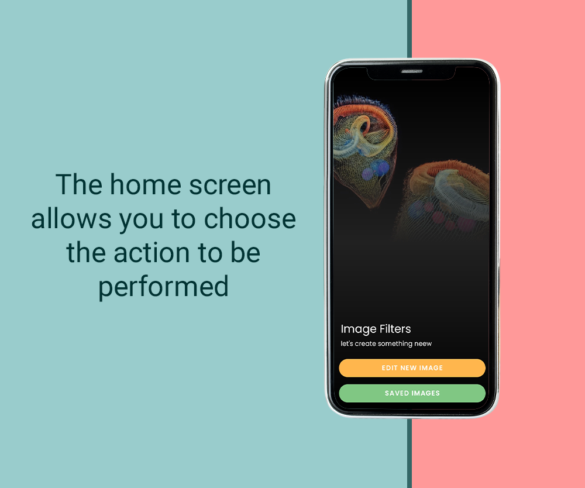
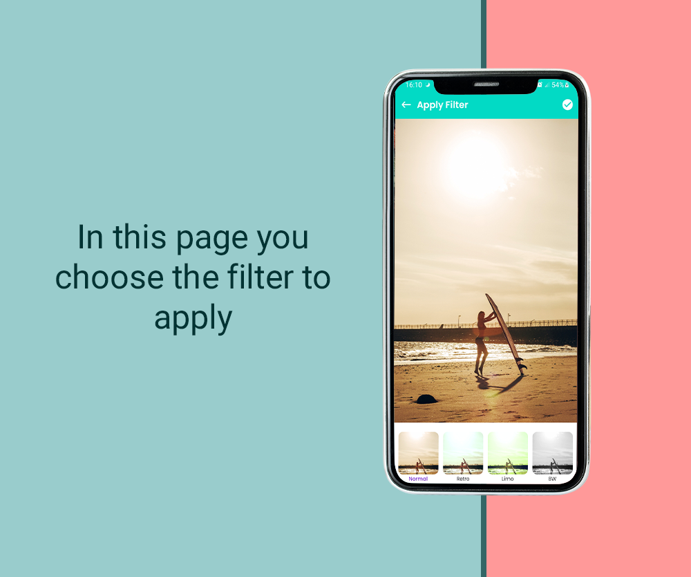
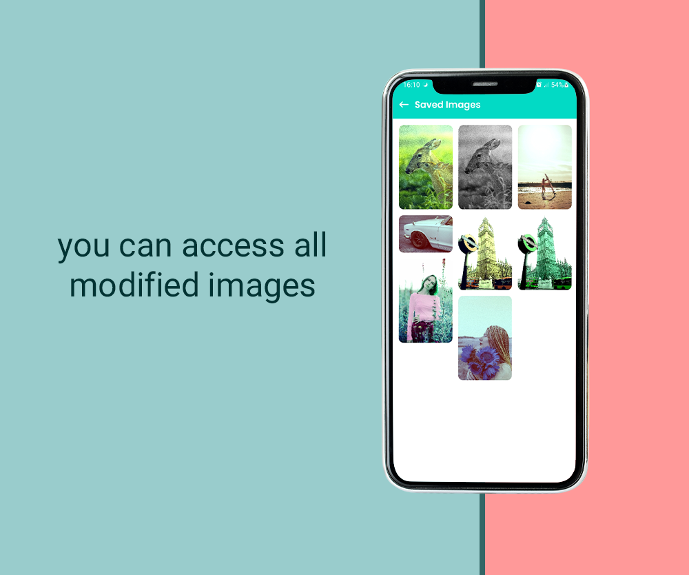
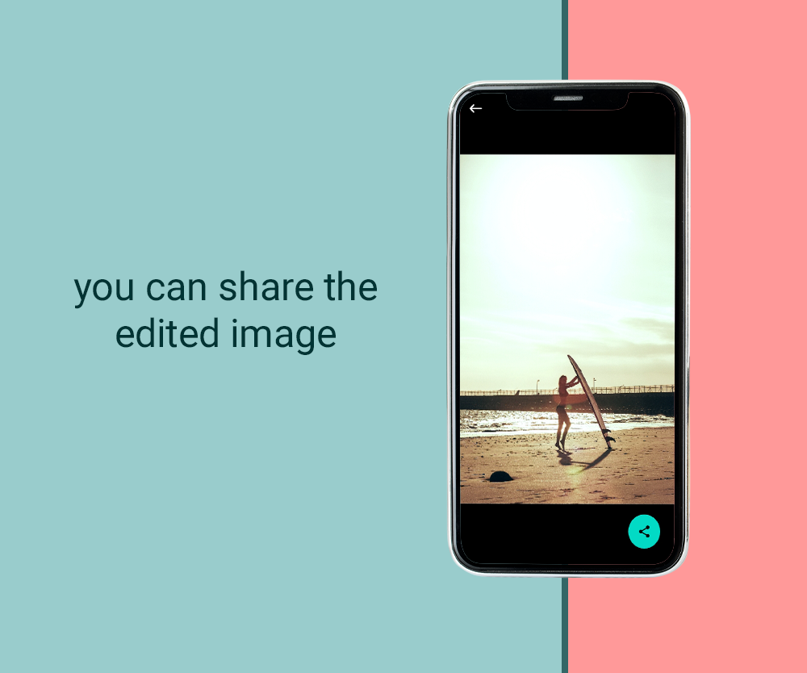

# Android Image Filters App - README

This repository contains the source code for an Android Image Filters App developed using Kotlin and following the MVVM architecture. The app allows users to apply various image filters to their photos. The development of this app was inspired by the tutorial series titled "Android Image Filters App Development | Kotlin + MVVM" by Chirag Kachhadiya.

## Tutorial Information
- Tutorial Title: Android Image Filters App Development | Kotlin + MVVM
- YouTube Video: [Android Image Filters App Tutorial](https://www.youtube.com/watch?v=dtlZENmOzp4&list=PLam6bY5NszYOGk7-8S9F3K4YpjLt2nKv8&ab_channel=ChiragKachhadiya)
- Video Views: 8,509
- Published Date: May 3, 2021

## Overview
In this tutorial series, we build an "Image Filters App" using the MVVM architecture and Kotlin programming language. The app allows users to apply various image filters to their photos. The tutorial covers key components such as MVVM architecture, View Binding, GPU Image for image processing, Material Design guidelines, and Koin for Dependency Injection.

## Key Components
1. MVVM Architecture
2. View Binding
3. GPU Image
4. Material Design
5. Koin - Dependency Injection

## Screens and Functionality
The app consists of four screens:

1. **Intro Screen (Landing Screen):**

2. **Image Selection and Editing Screen:**

3. **Saved edited images List Screen:** 

4. **Share Edited image Screen:** 

## Acknowledgments
This project is based on the tutorial series "Android Image Filters App Development | Kotlin + MVVM" by Chirag Kachhadiya. Special thanks to Chirag for providing valuable insights and guidance throughout the development process.
